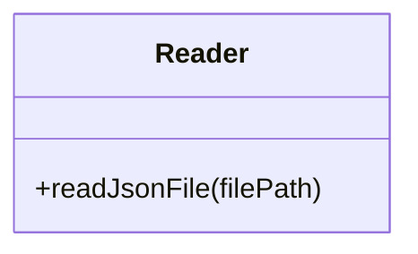
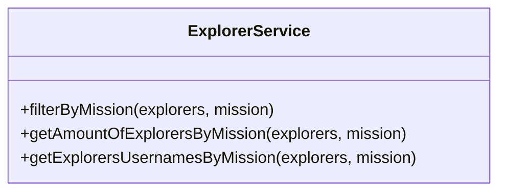
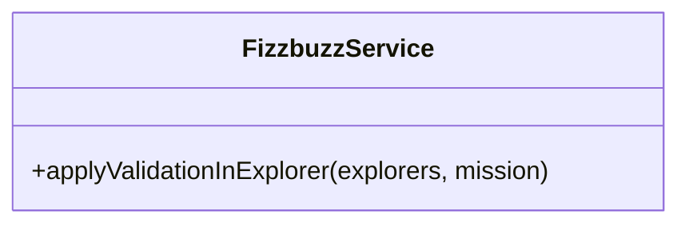

# Practice Launch X

### Refactoring

This is a repository where I am practicing refactoring a legacy code.

The refactoring has the next classes:

```mermaid
classDiagram
    class Reader
    Reader : +readJsonFile(filePath)
```

```mermaid        
classDiagram
    class ExplorerService
    ExplorerService : +filterByMission(explorers, mission)
    ExplorerService : +getAmountOfExplorersByMission(explorers, mission)
    ExplorerService : +getExplorersUsernamesByMission(explorers, mission)
```

```mermaid        
classDiagram
    class FizzbuzzService
    FizzbuzzService : +applyValidationInExplorer(explorers, mission)
```